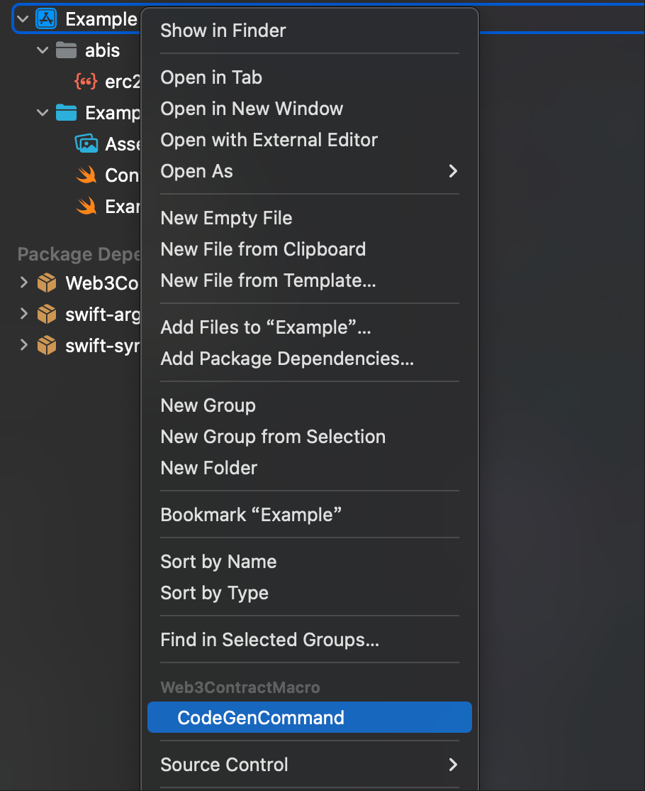

## 适用于 [Web3Swift](https://github.com/web3swift-team/web3swift) 的代码生成工具，用于生成类型安全的合约代码。

## 使用
在 Xcode 中通过 SPM 导入。
```
.package(url: "https://github.com/zhangliugang/Web3ContractMacro", from: "1.0.0"),
```

在文件菜单中选择 CodeGenCommand，或者右键点击 Project 然后选择 CodeGenCommand，然后点击确认。

这将根据提供的合约 ABI 文件自动生成用于访问合约的代码



## 示例

erc20.json
```json
[
  {
    "constant": true,
    "inputs": [],
    "name": "name",
    "outputs": [
      {
        "name": "",
        "type": "string"
      }
    ],
    "payable": false,
    "stateMutability": "view",
    "type": "function"
  },
  {
    "constant": false,
    "inputs": [
      {
        "name": "_spender",
        "type": "address"
      },
      {
        "name": "_value",
        "type": "uint256"
      }
    ],
    "name": "approve",
    "outputs": [
      {
        "name": "",
        "type": "bool"
      }
    ],
    "payable": false,
    "stateMutability": "nonpayable",
    "type": "function"
  }
]
```

erc20.swift
```swift
class Erc20 {
    public let contract: EthereumContract
    public let contractAddress: EthereumAddress
    public let web3: Web3

    init(abiString: String, address: EthereumAddress, web3: Web3) {
        self.contractAddress = address
        self.web3 = web3
        self.contract = try! EthereumContract(abiString)
    }

    public func name() async throws -> String {
        let method = contract.methods["name()"]!.first!
        let data = method.encodeParameters([])
        let transaction = CodableTransaction(to: contractAddress, data: data!)
        let returnData = try await web3.eth.callTransaction(transaction)
        let result = try method.decodeReturnData(returnData)
        return result[0] as! String
    }

    public func approve(_spender: EthereumAddress, _value: BigUInt) async throws -> Bool {
        let method = contract.methods["approve(address,uint256)"]!.first!
        let data = method.encodeParameters([_spender, _value])
        let transaction = CodableTransaction(to: contractAddress, data: data!)
        let returnData = try await web3.eth.callTransaction(transaction)
        let result = try method.decodeReturnData(returnData)
        return result[0] as! Bool
    }
}
```